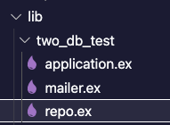
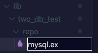
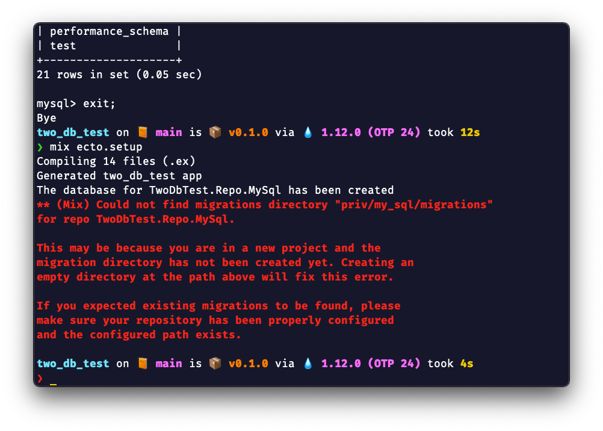
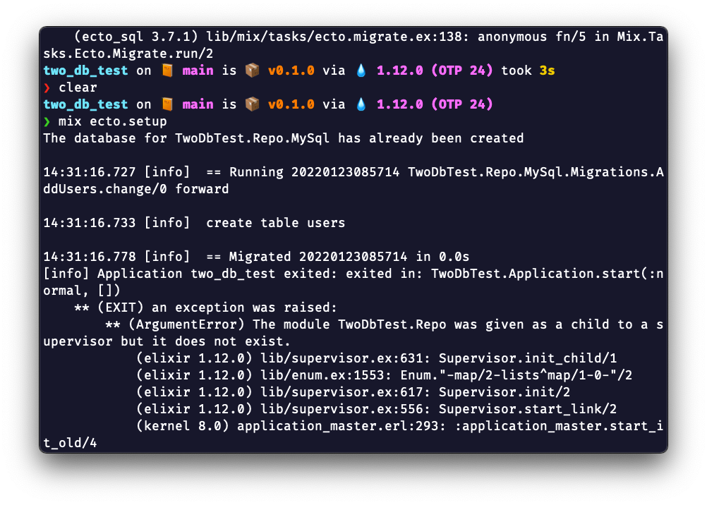
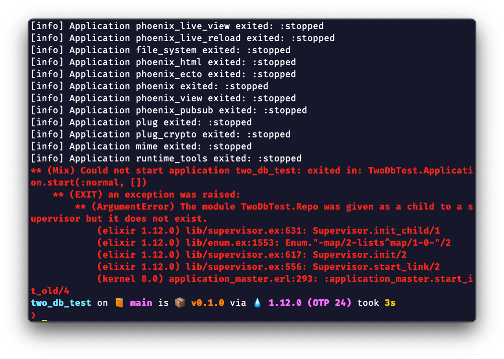

# TwoDbTest

This is a dummy repo to document how you can connect multiple databases to a single Phoenix server. You can follow the commits or the steps provided here.

> 📗\
 This repo can get obsolete as Phoenix/Elixir maintainers change Ecto and its related functionality.

## Commit #1

**Init**: Initialize the Phoenix repo using `mix phx.new two_db_test` and push it to GitHub. No config changes in this commit.

## Commit #2

**Configure MySQL with Phoenix**: By default, Phoenix creates a repo with Postgres drivers. I'll be using MySQL (since that's what I need at work too and hence this project 😜). So I'll have to replace the Postgres driver with MySQL driver. To do this:

1. We'll replace `:postgrex` with `:myxql` in `mix.exs` file.
  ElixirLS will freak out (if you use it) but you can run `mix deps.get` to fix it. 

2. We need to configure the repos. In Phoenix, repo == database. Tables will be created under the repo (database.) In Phoenix, the repo is specified in the `config.exs` file. But if you see, a repo is already specified there.\
\
That's because when you create a new Phoenix project using `mix phx.new <project>`, it takes care of the scaffolding. Also note that the `ecto_repos` property of the `config/2` function takes an array, which indicates that Phoenix supports multiple repos. We'll need that later.\
However, we'll have to tweak this a bit since we'll be using two databases. In the folder hierarchy, you can see that the `repo.ex` file is created under `lib/two_db_test`.\
\
Since we'll be using two databases, I'll organize the files and folders a bit. I'll create a folder called `repo` under `lib/two_db_test` and move `repo.ex` under the folder. In addition, I'll rename the file `repo.ex` to `mysql.ex` so that we can later differentiate which database Phoenix should talk to. It'll be easier to use in the code too (we'll get to that in a bit).\
\
To stick to the convention, I'll modify the file. Currently, it looks like:

    ```elixir
    defmodule TwoDbTest.Repo do
      use Ecto.Repo,
        otp_app: :two_db_test,
        adapter: Ecto.Adapters.Postgres
    end
    ```

    We'll change it to:

    ```elixir
    defmodule TwoDbTest.Repo.MySql do
      use Ecto.Repo,
        otp_app: :two_db_test,
        adapter: Ecto.Adapters.MyXQL
    end
    ```

    I have changed the module name to match the folder hierarchy. In addition, we have changed the adapter to `MyXQL` since we'll be using MySQL as our database instead of Postgres.

    However, now since the repo's configuration lives in the `TwoDbTest.Repo.MySql` module, we need to go back to `config.exs` and tell Phoenix that it should look for the repo's configuration in the new module.

    So we'll change:

    ```elixir
    config :two_db_test,
      ecto_repos: [TwoDbTest.Repo]
    ```

    to:

    ```elixir
    config :two_db_test,
      ecto_repos: [TwoDbTest.Repo.MySql]
    ```

    The next step would be to tell Phoenix what should be the name of the database in MySQL under which it should create tables and add data to it. Since Phoenix separates the operation modes as dev, test, and prod, it provides a script(`.exs`) file for each mode. Since I'll be only running Phoenix in dev mode on my laptop for this exercise, we'll specify the database name in the `dev.exs` file only.

    In the `dev.exs` file, I'll change:

    ```elixir
    config :two_db_test, TwoDbTest.Repo,
      username: "postgres",
      password: "postgres",
      database: "two_db_test_dev",
      hostname: "localhost",
      show_sensitive_data_on_connection_error: true,
      pool_size: 10
    ```

    to:

    ```elixir
    config :two_db_test, TwoDbTest.Repo.MySql,
      username: "root",
      password: "",
      database: "two_db_test_dev",
      hostname: "localhost",
      show_sensitive_data_on_connection_error: true,
      pool_size: 10
    ```

    Note that I have changed the name of the module (the second property that we send to the `config/3` function), and changed the username and password properties according to the default MySQL settings. I am leaving the database name as it is. In addition, I'm leaving hostname as it is too since the MySQL instance is running locally. I am not sure about the remaining two properties, so I'm leaving those two as it is.

    At this point, we can run `mix ecto.setup`. It should create the `two_db_test_dev` database in our MySQL instance. To learn more about what `mix ecto.setup` does, you can take a look at Mix's documentation. In addition, its alias is specified in the `mix.exs` file at the bottom. It tells you the commands mix will run when you run `mix ecto.setup`. As a quick reference, `mix ecto.setup` runs:

    - `ecto.create`: It'll connect to the database instances and create the repos that you specify in the `config.exs` file. Remember that it's an array. If you have more than one repos configured, Phoenix will create both the repos in the instances of all the databases that you connect. We'll get to that in a bit.
    - `ecto.migrate`: It'll run migration on the databases that you configured (such as adding tables to the database, updating tables etc.) We'll get to that in a bit.
    - `run priv/repo/seeds.exs`: If you have sample data that your tables should be populated with, you can use this file to provide the data

    As expected, when we run `mix ecto.setup`, mix can create the database in MySQL.\
    

    It says that there are no migrations. I'll save progress so far and add a table in commit #3.

## Commit #3

We'll add a table in this commit so that `ecto.setup` doesn't complain that you don't have any migrations. I'll run `mix ecto.gen.migration add_users` to add a dummy users table for this exercise.

However, when I'll run `mix ecto.setup`, it'll create the table:\


But it throws this error. 🤦‍♂️\


So I configured everything except that I forgot to tell the application's supervisor that the ecto app is now in the module called `TwoDbTest.Repo.MySql`. To fix this problem, I need to open `lib/two_db_test/application.ex` and update the children array with the appropriate module name of the ecto app.

This not necessarily directly related to what we're doing today(maybe it is), but I'm making a note of it since I can run into this in the future too (because I have run into this in the past 😂).

And then when I run `mix ecto.setup`, everything will look okay.


## Commit #4

Now that we have configured Phoenix to connect to MySQL, we'll configure it to connect to ScyllaDB. Like Last time, we'll get started with the driver. Since there's no official Ecto driver for Scylla(or Cassandra), we'll use the driver called [EctoXandra](https://github.com/blueshift-labs/ecto_xandra) that the good folks at Blueshift (my current employer 😊) have written.

Like earlier, we'll go to the `mix.exs` file and add the driver (`{:ecto_xandra, git: "https://github.com/blueshift-labs/ecto_xandra.git", tag: "0.1.9"}`) in the list of dependencies.

However, if ElixirLS goes crazy on your `mix.exs` file this time, it's possible that you may have to run `mix deps.unlock --all` before running `mix deps.get` to get it to work.

Next, like last time, we need to configure the repos in the `config.exs` file. We'll change:

```elixir
config :two_db_test,
  ecto_repos: [TwoDbTest.Repo.MySql]
```

to

```elixir
config :two_db_test,
  ecto_repos: [TwoDbTest.Repo.MySql, TwoDbTest.Repo.Scylla]
```

Remember that we discussed that the `ecto_repos` property takes an array? This is where this will come in handy. Now, since there's no such module called `TwoDbTest.Repo.Scylla`, we'll create one.


And we'll set its contents to:

```elixir
defmodule TwoDbTest.Repo.Scylla do
  use Ecto.Repo,
    otp_app: :two_db_test,
    adapter: EctoXandra
end
```

Like last time, next step would be to tell Phoenix what should be the name of the database in Scylla under which it should create tables and add data to it. As we discussed earlier, Phoenix separates the operation modes as dev, test, and prod, it provides a script(.exs) file for each mode. Since I'll be only running Phoenix in dev mode on my laptop for this exercise, we'll specify the database name in the dev.exs file only.

In the dev.exs file, I'll add config for Scylla:

```elixir
config :two_db_test, TwoDbTest.Repo.Scylla,
  keyspace: "two_db_test_dev",
  nodes: ["127.0.0.1:10042"],
  telemetry_prefix: [:repo],
  protocol_version: :v4,
  pool_size: 10,
  default_consistency: :quorum,
  retry_count: 5,
  log_level: :debug
```

Note that I'm not super sure of all the properties except keyspace and nodes... so I have copy-pasted configs from what I got from nice folks at Blueshift.

I'll try to run mix ecto.setup again, just to see if Mix can create the keyspace in ScyllaDB.

And luckily for us, it very well can.


The next step can be tricky, since standard ecto migrations do not work with Scylla. So we'll create an Elixir script `.exs` file manually, unlike last time when we ran `mix ecto.gen.migration <migration>`.

In the `priv` directory, I'll add `scylla/migration` path, and a file called `add_products.exs`. This file will create a dummy products table in Scylla. You can review the commit to see the table and the commands it'll run. (Honestly, I'm not super sure about Scylla and its commands either, so I'm kinda blindly following what good folks at Blueshift did. 😜)

Now that we have specified the migrations for Scylla, we'll have to change a few things in the `mix.exs` file. Right at the bottom, Phoenix generates aliases that specify what needs to be done when you run certain mix commands. We'll have to change that. 

So from:

```elixir
defp aliases do
  [
    setup: ["deps.get", "ecto.setup"],
    "ecto.setup": [
      "ecto.create",
      "ecto.migrate",
      "run priv/repo/seeds.exs"
    ],
    "ecto.reset": ["ecto.drop", "ecto.setup"],
    test: ["ecto.create --quiet", "ecto.migrate --quiet", "test"],
    "assets.deploy": ["esbuild default --minify", "phx.digest"]
  ]
end
```

we'll change it to:

```elixir
defp aliases do
  [
    setup: ["deps.get", "ecto.setup"],
    "ecto.setup": [
      "ecto.create",
      "run priv/scylla/migrations/add_products.exs",
      "ecto.migrate -r TwoDbTest.Repo.MySql",
      "run priv/repo/seeds.exs"
    ],
    "ecto.reset": ["ecto.drop", "ecto.setup"],
    test: ["ecto.create --quiet", "ecto.migrate --quiet", "test"],
    "assets.deploy": ["esbuild default --minify", "phx.digest"]
  ]
end
```

Note that after `"ecto.create"`, we have added `"run priv/scylla/migrations/add_products.exs"`, and we have changed `"ecto.migrate"` to `:"ecto.migrate -r TwoDbTest.Repo.MySql"`. We're doing this to:

1. Run the migration script for Scylla manually.
2. Ensure that Ecto only migrates the database for MySQL otherwise Ecto will try to migrate ScyllaDB too but that'll run into issues.

At this point, we've successfully connected our Phoenix repo to two databases. I'll save the changes at this point. In the next commit:

- We'll write two APIs (one each for each DB)
- Use those APIs to write to the databases
- Write views that read from the two databases

## To start your Phoenix server

- Install dependencies with `mix deps.get`
- Create and migrate your database with `mix ecto.setup`
- Start Phoenix endpoint with `mix phx.server` or inside IEx with `iex -S mix phx.server`

Now you can visit [`localhost:4000`](http://localhost:4000) from your browser.

Ready to run in production? Please [check our deployment guides](https://hexdocs.pm/phoenix/deployment.html).

## Learn more

- [Official website](https://www.phoenixframework.org/)
- [Guides](https://hexdocs.pm/phoenix/overview.html)
- [Docs](https://hexdocs.pm/phoenix)
- [Forum:](https://elixirforum.com/c/phoenix-forum)
- [Source](https://github.com/phoenixframework/phoenix)
